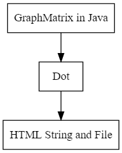
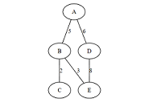
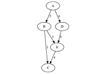

# GraphMatrixTool
A Tool for Visualizing GraphMatrix，With the help of [Graphviz](http://www.graphviz.org/)，[Viz.js](https://github.com/mdaines/viz.js/)，[GraphvizOnline](https://dreampuf.github.io/GraphvizOnline/#)

**Basic process**：

**example output**：

<table>
    <tr>
        <td >
g1 Undirected
</td>
        <td >
g2 Directed
</td>
    </tr>
</table>

**TODO**：

* [x] GraphMatrixApp
* [x] BinTreeApp

There is a lot that can be done in this way, if there is enough time.